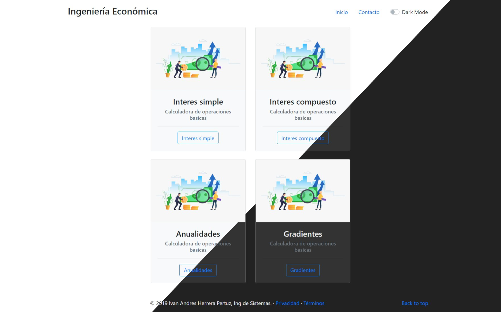

# Ingenieria-economica 👨‍💻

Este proyecto consiste en una pagina web para calcular las valor presente, valor futuro, interes, tasa de interes, tiempo en temas de la Ingenieria Economica como lo son Interes Simple, Compuesto, Anuliadades, Gradientes.

Siente te libre de descargar el proyecto para uso educativo. 

### Screenshots de la aplicación web

Vista previa de la aplicación.

Entre sus funciones, la aplicación cuenta con calculadora para `interes simple`, `interes compuesto`, `anualidades` y `gradientes`. También, tiene soporte para cambiar entre modos `Light` y `Dark`.

Las calculadoras esta maquetadas a partir de formularios `HTML` validados antes de ejecutar los calculos.

#### Tecnologias utilizadas:
- HTML
- CSS
- JavaScript
- Bootstrap 4.

#### Realizado por estudiante de la Corporacion Universitaria del Caribe CECAR
[Sígueme en Twitter](https://twitter.com/G2Pertu)
[Sígueme en Linkedin](https://www.linkedin.com/in/ivan-andres-herrera-pertuz-a81383222)
[Sígueme en Instagram](https://www.instagram.com/ivanherrera.27)
